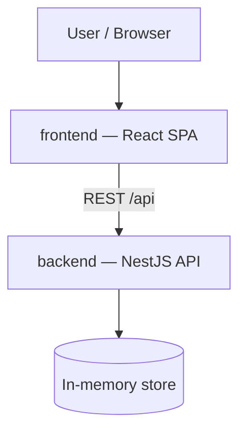

# Architecture — Ticket Tracker

## System Context

## Containers
- **backend/** — NestJS (TypeScript) REST API. Owns all domain state and rules. Serves everything under the `/api` prefix. State lives in in-memory stores inside Nest services (no database).
- **frontend/** — React + Vite (TypeScript) single-page app. Purely a client of the backend REST API; holds no domain rules, only view state.

The two containers are independent npm packages with separate lockfiles — no workspace tooling, no shared code package.

## Boundary Rules
- The frontend talks to the backend only via the `/api` REST endpoints (Vite dev proxy in development). It never embeds domain rules — a status change is always a request to the backend.
- Every ticket status change goes through the dedicated `PATCH /api/tickets/:id/status` endpoint backed by a single service method. This is the one designated seam where status-transition gating will later be added; no other code path may mutate a ticket's status.
- HTTP concerns (controllers, DTO validation) stay out of services; services own domain state and rules and know nothing about HTTP.

## Governing ADRs
- [ADR-0001 — Record architecture decisions](../adr/0001-record-architecture-decisions.md)
<!-- add links as ADRs are written, e.g. [ADR-0002 title](../adr/0002-slug.md) -->
