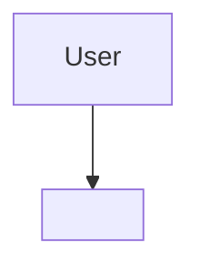

# Architecture — <project>

## System Context

## Containers
<containers — fill as they are decided; each ADR that adds or changes a container updates this section>

## Boundary Rules
- <boundary rule — e.g. all external I/O goes through an adapter layer>
- <boundary rule — e.g. core domain logic has no dependency on the delivery mechanism>

## Governing ADRs
- [ADR-0001 — Record architecture decisions](../adr/0001-record-architecture-decisions.md)
<!-- add links as ADRs are written, e.g. [ADR-0002 title](../adr/0002-slug.md) -->
